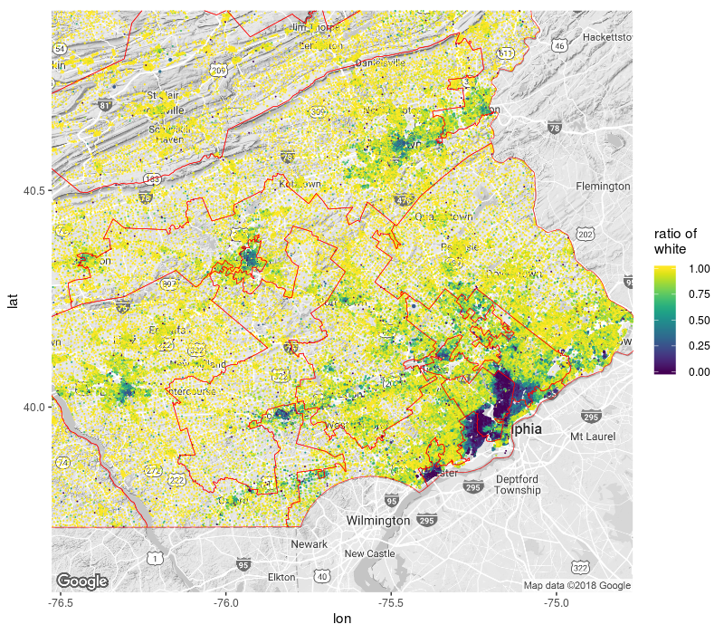
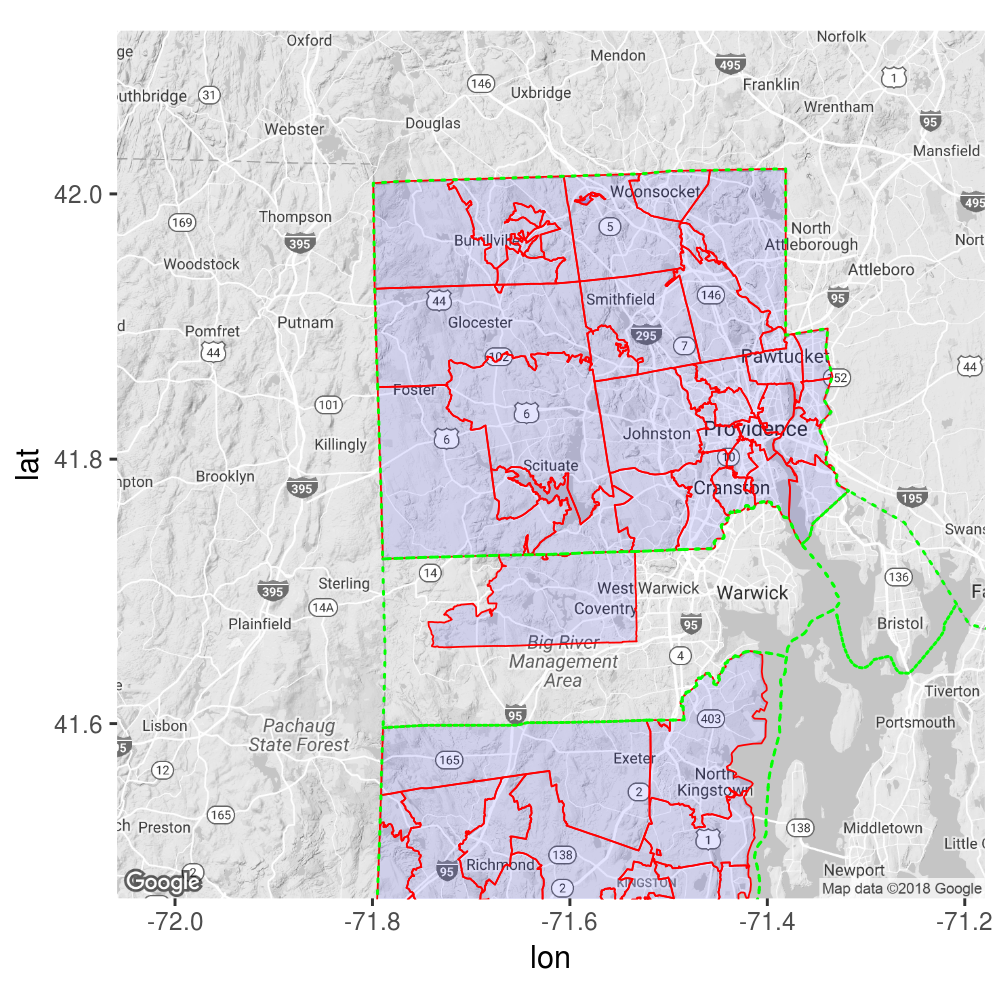

---
output:
  md_document:
    variant: markdown_github
---


```{r, echo = FALSE}
knitr::opts_chunk$set(
    collapse = TRUE,
    comment = "#>",
    fig.path = "README-",
    message = FALSE,
    warning = FALSE,
    eval = FALSE
)
```


[](https://travis-ci.org/GL-Li/ggtiger)

# Draw TIGER census boundaries and plot census data on ggmap

This package draws TIGER census boundaries on ggmap with a single function `geom_bounday()` and plot census data on map with `geom_census()`. As extensions to `ggplot2`, `geom_boundary()` and `geom_census()` work similarly to native ggplot2 `geom_xxxx()` functions.

It currently draws boundaries of states, counties, county subdivisions, tracts, block groups, zip code tabulation areas, and congressional districts. More geographies are being added.

It now plot census data of 2010 decennial census, 2015, 2016 ACS 5-year survey, and 2014, 2015, 2016 ACS 1-year survey.


## Installation and setup

```{r eval = FALSE}
devtools::install_github("GL-Li/ggtiger")
```

Function `geom_boundary()` dowloads TIGER shape files into R with package `tigris`. The data is further processed for plotting. If you want to speed up the plotting, save the processed data to your computer. Check with function `set_path_to_tiger()`. 

Function `geom_census()` uses package `totalcensus` to process census data, which requires downloading census data to your computer. Follow the [instructions](https://github.com/GL-Li/totalcensus) to install and set up `totalcensus` package.

## Examples
By default, `geom_boundary()` draws all boundaries of a geography in the view of a ggmap. We can also choose to draw only those boundaries in selected states, or in selected counties in a state within the map.

Similarly, `geom_census` plot all available data points in the map. We can also choose which states and area to plot.

### New example: congressional district gerrymandering
When Republicans or Demecrats are in charge, they tend to draw congressional disctricts boundaries to their favor. This can go very ugly, creating crazy boundaries by a practice called [gerrymandering](https://en.wikipedia.org/wiki/Gerrymandering). 

We can visualize the gerrymandering easily with `ggtiger`. The figure below shows a few congressional districts near Philadelpia in Pennsylvania for 115th Congress, including the (in)famous [7th congressional district](https://en.wikipedia.org/wiki/Pennsylvania%27s_7th_congressional_district).

```{r}
library(ggtiger)
register_google(Sys.getenv("GOOGLE_API"))
philly <- get_map("pottstown, PA,  usa", zoom = 9, color = "bw")
ggmap(philly) +
    geom_boundary("congressional district", states = "PA",
                  mapping = aes(fill = ..GEOID..),
                  alpha = 0.7, color = "red", size = 0.3) +
    scale_fill_brewer(palette = "PuOr")
```


Even better, with function `geom_census()`, we can plot demographics on the map. This function depends on package `totalcensus`. Please visit [this repo](https://github.com/GL-Li/totalcensus) to find out how to use it.

```{r}
library(viridis)
ggmap(philly) +
    # plot demographic at each census block as a point, sized by population
    # and colored by ratio of white people
    geom_census("decennial", year = 2010, states = "PA",
                table_contents = "white = P0030002",
                summary_level = "block",
                mapping = aes(color = ..white../..population..)) +
    # draw congressional district boundaries
    geom_boundary("congressional district", states = "PA",
                  fill = NA, color = "red", size = 0.2) +
    scale_size_area(max_size = 1) +   
    scale_color_viridis() +
    guides(size = "none") +  
    labs(color = "ratio of\nwhite")
```



### Draw boundaries
Boundaries of state, county, county subdivision, tract, and block group:
```{r}
library(ggtiger)
ri <- get_map("scituate, RI, united states", zoom = 10, color = "bw")
ggmap(ri) +
    # all tract boundaries in two counties in Rhode Island
    geom_boundary("tract", states = "RI", counties = c("providence", "washington"),
                  fill = NA, color = "orange", size = 0.2) +
    # all county boundaries in the map
    geom_boundary("county", fill = NA, 
                  color = "green", size = 0.3) +
    # all state boundaries in the map
    geom_boundary("state", fill = NA, linetype = "dotted", 
                  color = "red", size = 0.5)

```


 Boundaries of ZCTA (zip code tabulation area, based on zip code): be aware that ZCTAs sometimes cross county boundaries and even state boundaries.
```{r}
ggmap(ri) +
    # all ZCTAs in or partially in two counties in Rhode Island
    geom_boundary("zip code", states = "RI", 
                  counties = c("providence", "washington"),
                  fill = "blue", alpha = 0.1, color = "red", size = 0.3) +
    # all county boundaries in RI. 
    geom_boundary("county", state = "RI", fill = NA, color = "green", 
                  size = 0.5, linetype = "dotted")

```




### Fill in boudaries
We can fill in boudaies using argument `data_fill` in `geom_boundary()`. This argument takes a data frame that has `GEOID` as the first column and fill-in values as the second or other columns. You can use argument `mapping = aes(fill = ..xxx..)` to specify the fill column. Remember to add two dots `..` before and after the column name. If the data frame is extracted using census packages such as `tidycensus` and `totalcensus`, it already has the `GEOID` column.

```{r fig.width=12}
library(tidycensus)
census_api_key("your own api key")
# get the median home value in Providence county, RI by tract
home_value <- get_acs("tract", "B25077_001", state = "RI", county = "Providence") 
head(home_value, 3)
#    GEOID       NAME                                               variable   estimate   moe
#    <chr>       <chr>                                              <chr>         <dbl> <dbl>
#  1 44007000101 Census Tract 1.01, Providence County, Rhode Island B25077_001   155000  9765
#  2 44007000102 Census Tract 1.02, Providence County, Rhode Island B25077_001   154700 11819
#  3 44007000200 Census Tract 2, Providence County, Rhode Island    B25077_001   134600 31087

ggmap(ri) +
    geom_boundary("tract", data_fill = home_value, 
                  mapping = aes(fill = ..estimate..),
                  color = "blue", size = 0.1, alpha = 0.8) +
    geom_boundary("state", fill = NA, color = "red") +
    scale_fill_gradient(na.value = NA, low = "cyan", high = "orange") +
    labs(fill = "home_value")
```


### Combine with point plot
Let's look at the black community near South Bend, Indiana. We present the population at each census block as a point, sized with total population and colored with percentage of black population. On top of that, we draw the boundaries of census tract.

```{r fig.width=12}
library(totalcensus)
library(magrittr)
sb_black <- read_decennial(
    year = 2010,
    states = "IN",
    table_contents = "black_popul = P0030003",
    areas = "St. Joseph County, IN",
    summary_level = "block"
) %>% 
    .[population != 0] %>%
    # percentage of black population in each block
    .[, black_pct := round(100 * black_popul / population, 2)] %>%
    .[order(black_pct)]

sb <- get_map("south bend, IN", zoom = 13, color = "bw")
p <- ggmap(sb) +
    geom_point(data = sb_black, alpha = 0.8,
               aes(lon, lat, size = population, color = black_pct)) +
    geom_boundary("tract", fill = NA, color = "orange", size = 0.5) +
    scale_size_area(max_size = 15, breaks = c(10, 100, 200, 500, 4000)) +
    scale_color_continuous(low = "green", high = "red") 
p
```


```{r}
# to zoom in
p +  coord_map(xlim = c(-86.26, -86.21), ylim = c(41.67, 41.7))
```


