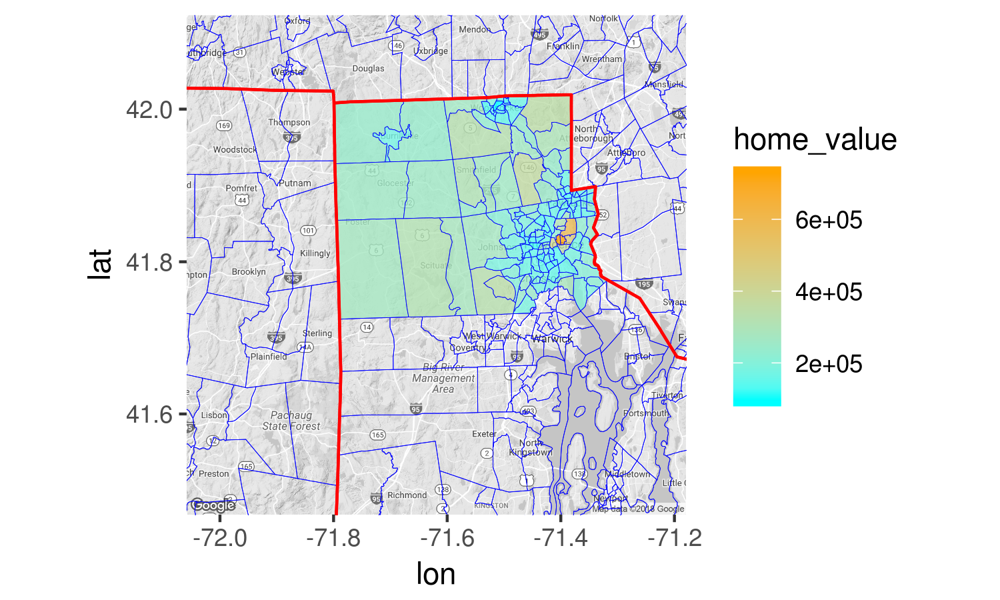
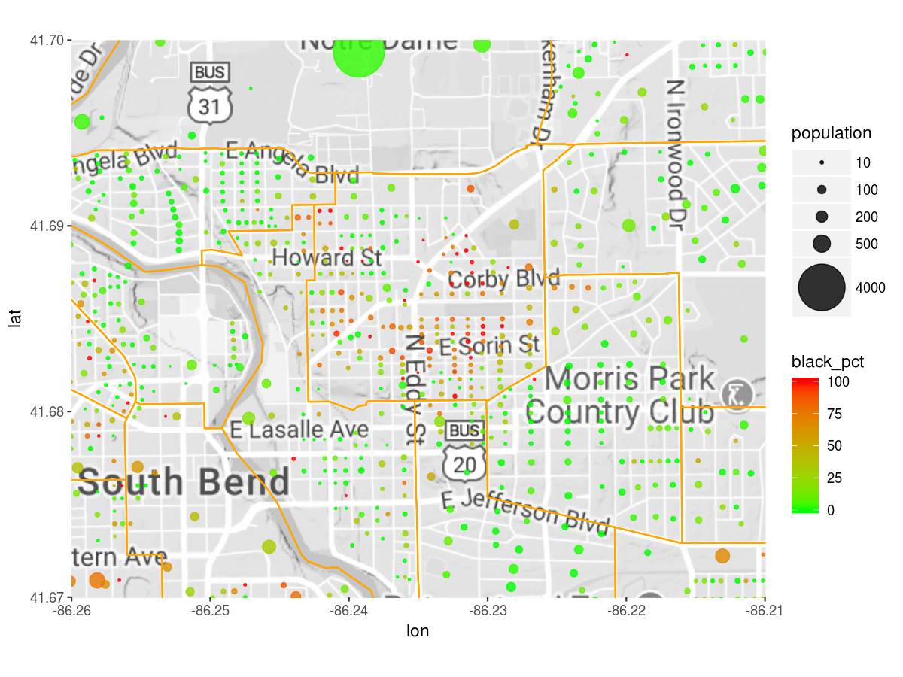

[](https://travis-ci.org/GL-Li/ggtiger)

Draw TIGER census boundaries on ggmap
=====================================

This package draws TIGER census boundaries on ggmap with a single function `geom_bounday()`. As an extension to `ggplot2`, `geom_boundary()` works similarly to native ggplot2 `geom_xxxx()` functions.

It currently draws boundaries of states, counties, county subdivisions, tracts, block groups, and zip code tabulation areas. More geographies are being added.

Installation
------------

``` r
devtools::install_github("GL-Li/ggtiger")
```

This package dowloads TIGER shape files into R with package `tigris`. The data is further processed for plotting. If you want to speed up the plotting, save the processed data to your computer. Check with function `set_path_to_tiger()`.

Examples
--------

By default, `geom_boundary()` draws all boundaries of a geography in the view of a ggmap. We can also choose to draw only those boundaries in selected states, or in selected counties in a state within the map.

### Draw boundaries

Boundaries of state, county, county subdivision, tract, and block group:

``` r
library(ggtiger)
ri <- get_map("scituate, RI, united states", zoom = 10, color = "bw")
ggmap(ri) +
    # all tract boundaries in two counties in Rhode Island
    geom_boundary("tract", state = "RI", county = c("providence", "washington"),
                  fill = NA, color = "orange", size = 0.2) +
    # all county boundaries in the map
    geom_boundary("county", fill = NA, 
                  color = "green", size = 0.3) +
    # all state boundaries in the map
    geom_boundary("state", fill = NA, linetype = "dotted", 
                  color = "red", size = 0.5)
```


Boundaries of ZCTA (zip code tabulation area, based on zip code): be aware that ZCTAs sometimes cross county boundaries and even state boundaries.

``` r
ggmap(ri) +
    # all ZCTAs in or partially in two counties in Rhode Island
    geom_boundary("zip code", state = "RI", 
                  county = c("providence", "washington"),
                  fill = "blue", alpha = 0.1, color = "red", size = 0.3) +
    # all county boundaries in RI. 
    geom_boundary("county", state = "RI", fill = NA, color = "green", 
                  size = 0.5, linetype = "dotted")
```


### Fill in boudaries

We can fill in boudaies using argument `data_fill` in `geom_boundary()`. This argument takes a data frame that has `GEOID` as the first column and fill-in values as the second column. If the data frame is extracted using census packages such as `tidycensus` and `totalcensus`, it already has the `GEOID` column.

``` r
library(tidycensus)
library(dplyr)
census_api_key("use your own census api key")
# get the median home value in Providence county, RI by tract
home_value <- get_acs("tract", "B25077_001", state = "RI", county = "Providence") %>%
    select(c("GEOID", "estimate"))
ggmap(ri) +
    geom_boundary("tract", data_fill = home_value, 
                  color = "blue", size = 0.1, alpha = 0.8) +
    geom_boundary("state", fill = NA, color = "red") +
    scale_fill_gradient(na.value = NA, low = "cyan", high = "orange") +
    labs(fill = "home_value")
```



### Combine with point plot

Let's look at the black community near South Bend, Indiana. We present the population at each census block as a point, sized with total population and colored with percentage of black population. On top of that, we draw the boundaries of census tract.

``` r
library(totalcensus)
sb_black <- read_decennial(
    year = 2010,
    states = "IN",
    table_contents = "black_popul = P0030003",
    areas = "St. Joseph County, IN",
    summary_level = "block"
) %>% 
    .[population != 0] %>%
    # percentage of black population in each block
    .[, black_pct := round(100 * black_popul / population, 2)] %>%
    .[order(black_pct)]

sb <- get_map("south bend, IN", zoom = 13, color = "bw")
p <- ggmap(sb) +
    geom_point(data = sb_black, alpha = 0.8,
               aes(lon, lat, size = population, color = black_pct)) +
    geom_boundary("tract", fill = NA, color = "orange", size = 0.5) +
    scale_size_area(max_size = 15, breaks = c(10, 100, 200, 500, 4000)) +
    scale_color_continuous(low = "green", high = "red") 
p
```


``` r
# to zoom in
p +  coord_map(xlim = c(-86.26, -86.21), ylim = c(41.67, 41.7))
```


